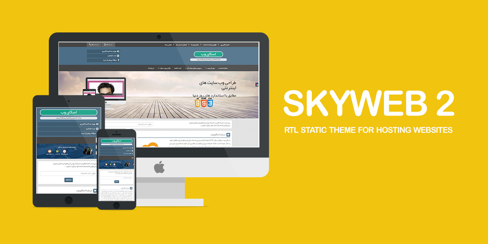

# SKYWEB 2

RTL Static Theme For Hosting Websites

It is built with Bootstrap 3 and includes multiple pages. It's suitable for RTL websites specially those which release in Persian and Arabic languages.

## Demo
View the online [Demo](https://geraked.ir/portfolio/themes/skyweb-2/).

## Author
**Rabist** - view on [LinkedIn](https://www.linkedin.com/in/rabist)

## License
Licensed under [MIT](LICENSE).